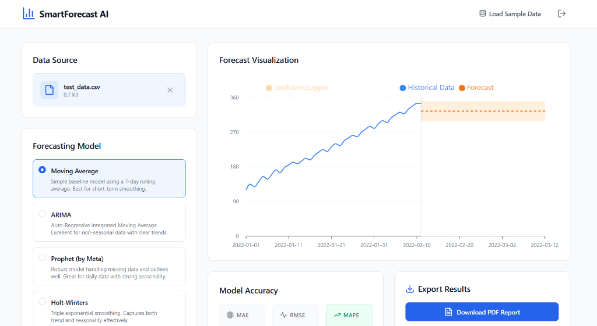
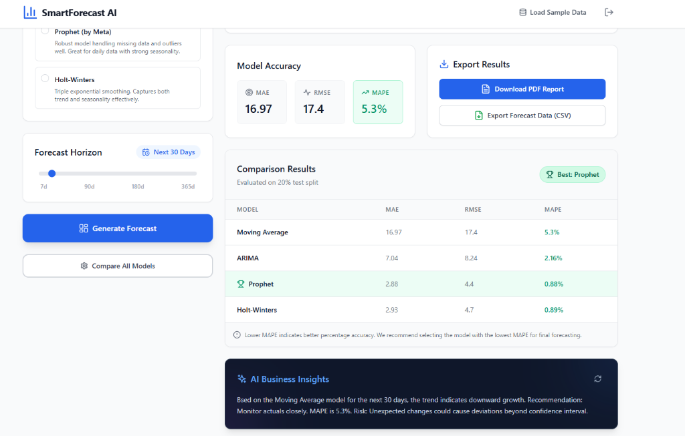

# SmartForecast AI 🚀

An AI-powered time series forecasting dashboard where users can upload CSV data, select a forecasting model, generate predictions with confidence intervals, get AI business insights from Google Gemini, compare all models, and download PDF/CSV reports.

<p align="center">
  
  
</p>

## Features
- 📊 **Upload & Visualize**: Drag and drop CSV files and visualize historical data instantly.
- 🤖 **Multiple AI Models**: Choose from Moving Average, ARIMA, Prophet, and Holt-Winters.
- ✨ **Gemini Insights**: Get AI-powered business insights and recommendations based on the forecast.
- 🏆 **Compare Models**: Run all models simultaneously to find the best fit for your dataset.
- 📄 **Export Reports**: Download comprehensive PDF reports and CSV data of your forecasts.
- 🔒 **Secure Auth**: JWT-based authentication to secure your dashboard.

## Tech Stack
| Frontend | Backend | AI/ML |
|----------|---------|-------|
| React 18 | FastAPI | Prophet |
| Vite     | Uvicorn | statsmodels (Holt-Winters) |
| Tailwind | Pandas  | pmdarima (ARIMA) |
| Recharts | Numpy   | Google Gemini |
| Axios    | PyJWT   | scikit-learn |

## Setup Instructions

### Environment Variables
Create a `.env` file in the `backend/` directory:
```env
GEMINI_API_KEY=your_gemini_api_key_here
SECRET_KEY=your_secret_key_here
ALGORITHM=HS256
ACCESS_TOKEN_EXPIRE_MINUTES=30
```
*Get your Gemini API key from [Google AI Studio](https://aistudio.google.com/).*

### Backend Setup
1. Navigate to the backend directory:
   ```bash
   cd backend
   ```
2. Create and activate a virtual environment (optional but recommended):
   ```bash
   python -m venv venv
   source venv/bin/activate  # On Windows: venv\Scripts\activate
   ```
3. Install dependencies:
   ```bash
   pip install -r requirements.txt
   ```
4. Run the server:
   ```bash
   uvicorn main:app --reload
   ```

### Frontend Setup
1. Navigate to the frontend directory:
   ```bash
   cd frontend
   ```
2. Install dependencies:
   ```bash
   npm install
   ```
3. Start the dev server:
   ```bash
   npm run dev
   ```

## Demo Credentials
To login to the local dashboard, use:
- **Username**: admin
- **Password**: admin123

## API Endpoints

| Method | Endpoint | Description |
|--------|----------|-------------|
| POST | `/auth/login` | Authenticate user and receive JWT |
| GET | `/sample` | Load pre-generated sample sales data |
| POST | `/upload` | Upload and parse CSV dataset |
| POST | `/forecast` | Run selected forecasting model |
| POST | `/compare` | Run all models and compare MAPE |
| POST | `/explain` | Generate Gemini business insights |
| POST | `/download/pdf` | Generate PDF report |
| POST | `/download/csv` | Export forecast data as CSV |
